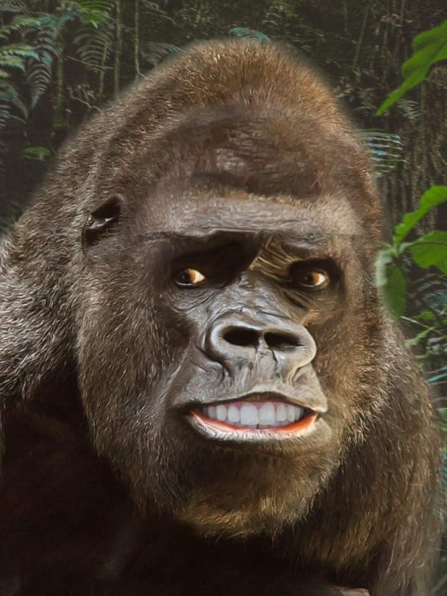
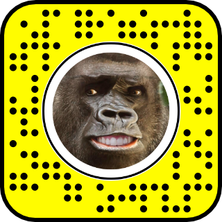

This was another fun lens to make. I'd originally been trying to match a 3D mesh to the picture, paint the image onto the mesh, and then track that to a user's head in Lens Studio. Unfortunately, there isn't an easy way to make the 3D model's facial features track those of the user. Instead, I took some inspiration from [CyreneQ's Mona Lisa lens](https://www.the11thsecond.com/2019/01/15/mona-lisa-snapchat-face-lens/) and opted to create a fake 3D effect in 2D.

A little bit of image editing gave me the background gorilla body and the isolated face. From there it was just a matter of layering things in Lens Studio to achieve the right look.

Here is the finished product

Check out the lens using this snapcode!
